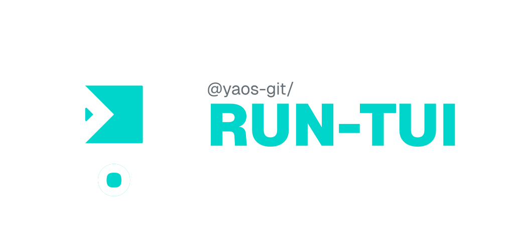
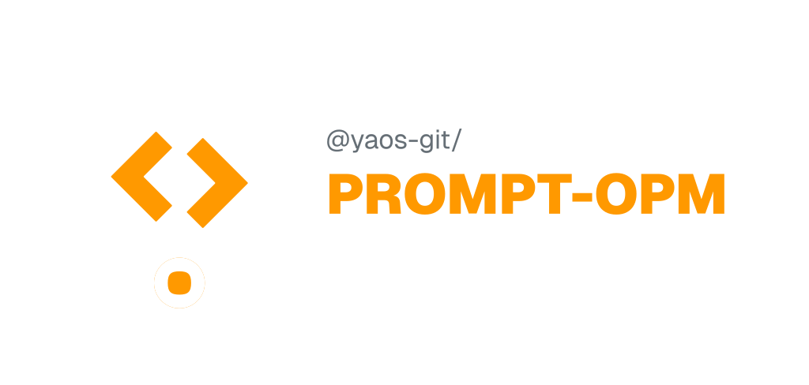
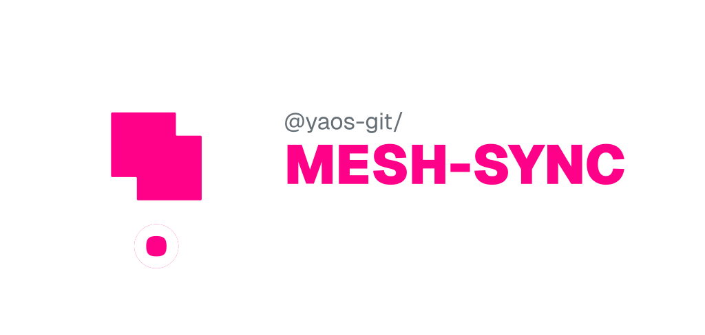
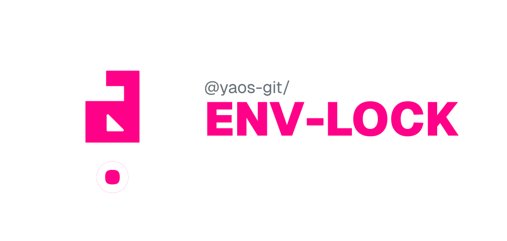
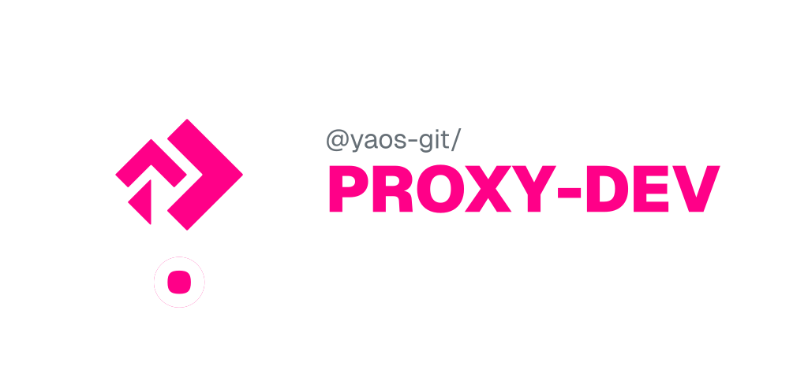
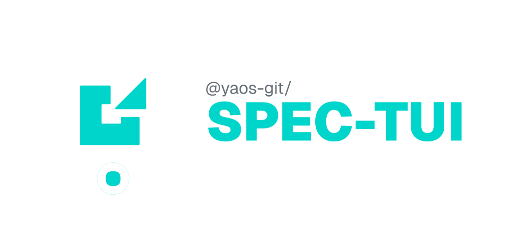
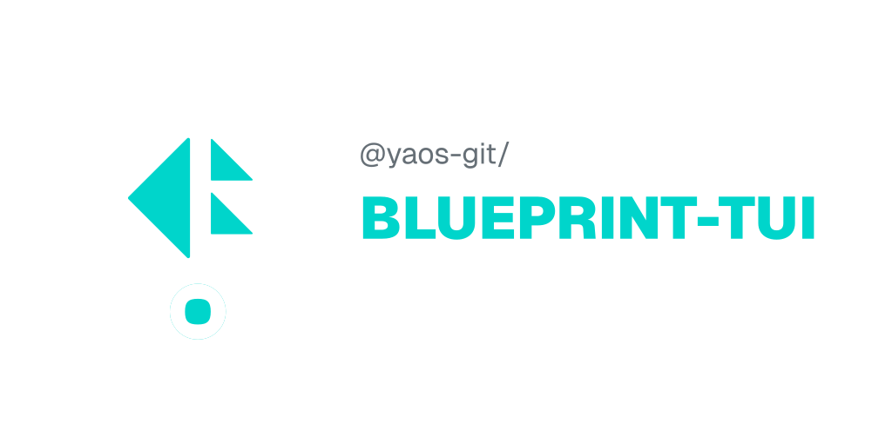
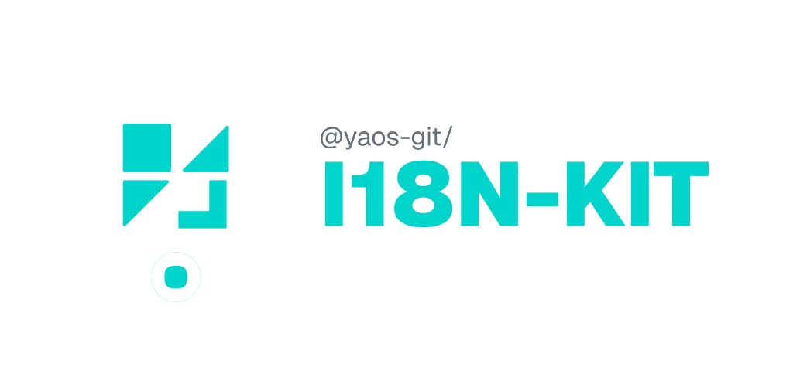

  <picture>
    <source media="(prefers-color-scheme: dark)" srcset="../images/general.svg">
    <source media="(prefers-color-scheme: light)" srcset="../images/general-light.svg">
    
  </picture>

  <strong>Yet Another Open Source — developer CLI tools built with TypeScript</strong>

  Twelve independent CLI tools and libraries, each published to npm under <code>@yaos-git/</code>, ISC-licensed.

---

### Philosophy

Good tools disappear into your workflow. They don't ask you to sign up, spin up a server, or leave your terminal. Every tool in this suite is **local-first**, no accounts, no cloud dependencies, no network required for core functionality. Just `npm install` and go.

Each project is its own repository with its own release cycle. No monorepo, no coordinated deploys, no version lock-in. Install one tool or all ten — they stand alone. But they're built to **coordinate**. The integration is there when you want it, invisible when you don't.

The interface is always the terminal. Where interaction is needed, it's a proper TUI, not a flag maze. Where automation is needed, it's a clean CLI with exit codes and structured output. Browser UIs are replaced, not wrapped.

---

<table>
<tr>
<td width="50%" valign="top">

<a href="https://github.com/YAOSGit/run-ctx">
  <picture>
    <source media="(prefers-color-scheme: dark)" srcset="../images/run-ctx.svg">
    <source media="(prefers-color-scheme: light)" srcset="../images/run-ctx-light.svg">
    
  </picture>
</a>

#### `@yaos-git/run-ctx`

A **context-aware command alias CLI** that resolves aliases to different commands based on your current directory, file patterns, and environment variables. Instead of remembering `npm run dev` vs `cargo watch -x run` vs `composer serve`, define a single `dev` alias that automatically resolves to the right command based on context. Specificity scoring ranks rules like a CSS cascade.

</td>
<td width="50%" valign="top">

<a href="https://github.com/YAOSGit/run-tui">
  <picture>
    <source media="(prefers-color-scheme: dark)" srcset="../images/run-tui.svg">
    <source media="(prefers-color-scheme: light)" srcset="../images/run-tui-light.svg">
    
  </picture>
</a>

#### `@yaos-git/run-tui`

An **interactive terminal UI** for running multiple npm scripts concurrently with real-time log monitoring, built with React and Ink. A single tabbed interface to launch, monitor, restart, and inspect dev server, tests, type checking, and more. Split-pane view, log filtering, fuzzy search, auto-restart, and support for npm, yarn, pnpm, and bun.

</td>
</tr>
<tr>
<td width="50%" valign="top">

<a href="https://github.com/YAOSGit/prompt-opm">
  <picture>
    <source media="(prefers-color-scheme: dark)" srcset="../images/prompt-opm.svg">
    <source media="(prefers-color-scheme: light)" srcset="../images/prompt-opm-light.svg">
    
  </picture>
</a>

#### `@yaos-git/prompt-opm`

A **local-first Object Prompt Mapper** that compiles `.prompt.md` files into type-safe TypeScript modules with Zod validation. Treats LLM prompts as first-class code artifacts — write them in Markdown, get type-safe TypeScript with compile-time guarantees. Auto-versioning, snippet composition, and incremental builds via SHA256 content hashing.

</td>
<td width="50%" valign="top">

<a href="https://github.com/YAOSGit/mesh-sync">
  <picture>
    <source media="(prefers-color-scheme: dark)" srcset="../images/mesh-sync.svg">
    <source media="(prefers-color-scheme: light)" srcset="../images/mesh-sync-light.svg">
    
  </picture>
</a>

#### `@yaos-git/mesh-sync`

A **cross-repo file sync tool** that keeps files in sync across independent repositories with real-time transformations. The "anti-monorepo" — get the safety of shared code without the overhead. Supports local files, URLs with ETag caching, and git repos. 62 built-in transformers with chaining, running in isolated Worker threads.

</td>
</tr>
<tr>
<td width="50%" valign="top">

<a href="https://github.com/YAOSGit/env-lock">
  <picture>
    <source media="(prefers-color-scheme: dark)" srcset="../images/env-lock.svg">
    <source media="(prefers-color-scheme: light)" srcset="../images/env-lock-light.svg">
    
  </picture>
</a>

#### `@yaos-git/env-lock`

A **security-first CLI** for encrypted environment injection. Commit secrets to git as AES-256-GCM encrypted `.env.enc` files, decrypted directly into process memory at runtime. Multi-lock team access via Argon2id/PBKDF2 key slots — plain-text never touches disk. Zod schema validation ensures required env vars are present after decryption.

</td>
<td width="50%" valign="top">

<a href="https://github.com/YAOSGit/proxy-dev">
  <picture>
    <source media="(prefers-color-scheme: dark)" srcset="../images/proxy-dev.svg">
    <source media="(prefers-color-scheme: light)" srcset="../images/proxy-dev-light.svg">
    
  </picture>
</a>

#### `@yaos-git/proxy-dev`

A **local-first reverse proxy and interceptor CLI** with a TUI dashboard. Intercept HTTPS traffic from your local domains, toggle mock responses, inject latency, and snapshot live responses — all without modifying your app code. On-the-fly TLS certs, per-route mock toggling, and a real-time traffic inspector.

</td>
</tr>
<tr>
<td width="50%" valign="top">

<a href="https://github.com/YAOSGit/spec-tui">
  <picture>
    <source media="(prefers-color-scheme: dark)" srcset="../images/spec-tui.svg">
    <source media="(prefers-color-scheme: light)" srcset="../images/spec-tui-light.svg">
    
  </picture>
</a>

#### `@yaos-git/spec-tui`

A **keyboard-driven TUI** for exploring, searching, and testing OpenAPI specifications directly from the terminal. A fast, local alternative to Swagger UI and Scalar. Three-pane layout with fuzzy search, schema-driven request forms with real-time Zod validation.

</td>
<td width="50%" valign="top">

<a href="https://github.com/YAOSGit/blueprint-tui">
  <picture>
    <source media="(prefers-color-scheme: dark)" srcset="../images/blueprint-tui.svg">
    <source media="(prefers-color-scheme: light)" srcset="../images/blueprint-tui-light.svg">
    
  </picture>
</a>

#### `@yaos-git/blueprint-tui`

An **interactive codebase onboarding TUI** that turns documentation into executable journeys. Define a `.blueprint/` directory with Markdown steps and YAML metadata, and blueprint-tui renders a guided two-pane tour with file teleportation (auto-detected editor support), runnable shell actions, and validation gates that verify completion before progressing.

</td>
</tr>
<tr>
<td width="50%" valign="top">

<a href="https://github.com/YAOSGit/i18n-kit">
  <picture>
    <source media="(prefers-color-scheme: dark)" srcset="../images/i18n-kit.svg">
    <source media="(prefers-color-scheme: light)" srcset="../images/i18n-kit-light.svg">
    
  </picture>
</a>

#### `@yaos-git/i18n-kit`

A **local-first i18n management CLI** with a TUI dashboard for translating, validating, and previewing locale files. It features a **Faker Lab** for generating realistic mock data, an **ICU Syntax Validator** for complex message interpolation, and **Project Health Scoring** to track translation completeness and expansion risks across all locales.

</td>
<td width="50%" valign="top">

<a href="https://github.com/YAOSGit/flow-lib">
  <picture>
    <source media="(prefers-color-scheme: dark)" srcset="../images/flow-lib.svg">
    <source media="(prefers-color-scheme: light)" srcset="../images/flow-lib-light.svg">
    
  </picture>
</a>

#### `@yaos-git/flow-lib`

A **generator-powered orchestration library** for building complex, multi-step workflows with explicit control flow. Define steps as generators, validate inputs with Zod schemas, and navigate flows with typed signals — next, jump, back, halt, retry. Immutable context snapshots, subroutine call stacks, and lifecycle event hooks for failure recovery.

</td>
</tr>
<tr>
<td width="50%" valign="top">

<a href="https://github.com/YAOSGit/patch-buddy">
  <picture>
    <source media="(prefers-color-scheme: dark)" srcset="../images/patch-buddy.svg">
    <source media="(prefers-color-scheme: light)" srcset="../images/patch-buddy-light.svg">
    
  </picture>
</a>

#### `@yaos-git/patch-buddy`

A **universal volatile state manager** that treats patches as first-class, toggleable layers on top of your real files. Persist hacky changes, library fixes, or temporary configs in a local `.patches/` directory. A foreground watcher automatically re-applies patches after `npm install`, `git pull`, or any external overwrite. Stack multiple patches per file, toggle them on/off, and resolve conflicts in your IDE.

</td>
<td width="50%" valign="top">

<a href="https://github.com/YAOSGit/access-lib">
  <picture>
    <source media="(prefers-color-scheme: dark)" srcset="../images/access-lib.svg">
    <source media="(prefers-color-scheme: light)" srcset="../images/access-lib-light.svg">
    
  </picture>
</a>

#### `@yaos-git/access-lib`

A **pure ABAC guard composition library** for building type-safe access control. Guards are composable boolean units evaluated against `{ context, resource }` pairs. Combine them with `.and()`, `.or()`, `.not()` to express any permission rule. Standard Schema validation, curried function protection, zero runtime dependencies.

</td>
</tr>
</table>

---

### Shared Stack

tsgo · esbuild · Vitest · Biome · Zod · Node.js 20+

### Author

Ygor de Paula

### License

ISC
